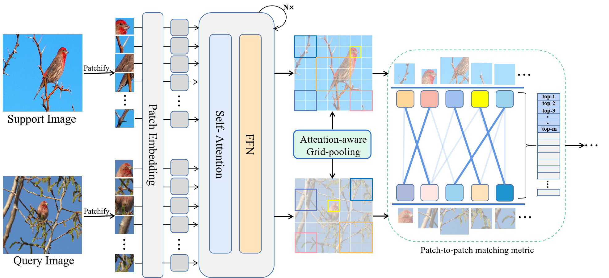
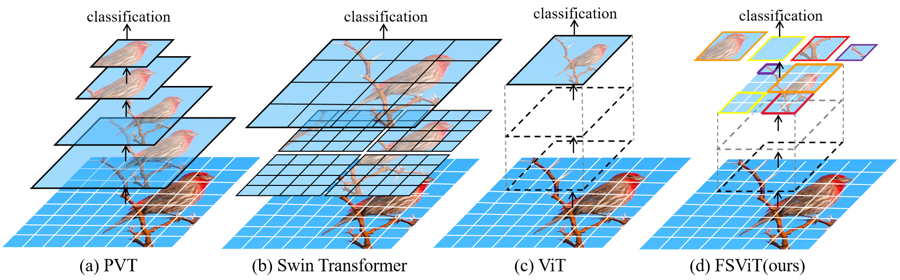
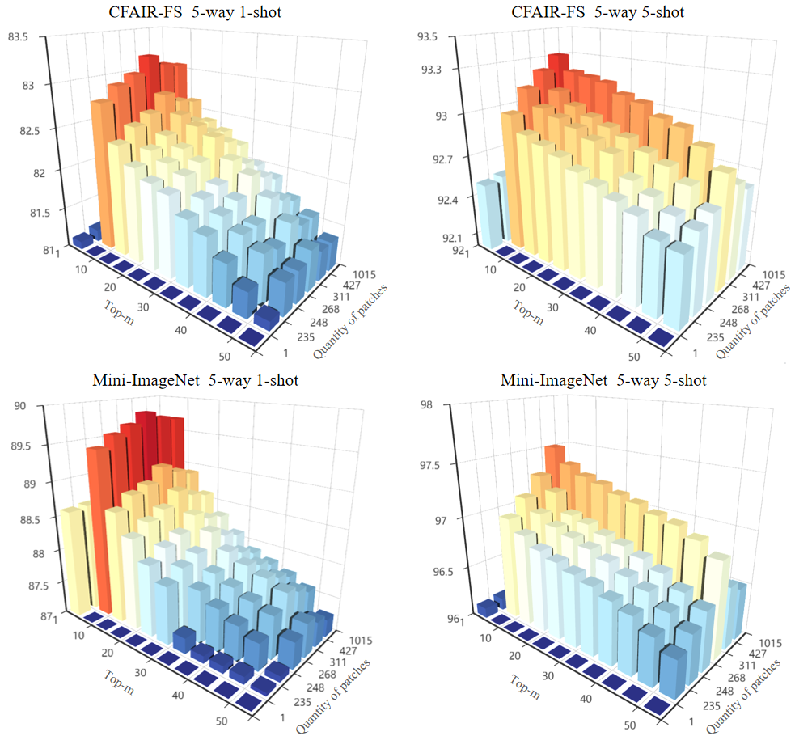

## Pipeline


## Requirements
Listed in `requirements.txt` Install with：
```
pip install -r requirements.txt
```
The code was tested with Python 3.8.1 and Pytorch >= 1.7.0.
We experimented on a single GEFORCE RTX 3090. 
The minimum GPU memory is 24GB. 

## Datasets
The overall structure of the `datasets` folder is the following:
```
datasets/
├── cdfsl/                     # CDFSL datasets
├── episodic_dataset.py        # CIFAR-FS & Mini-ImageNet
├── __init__.py                # summary & interface
├── mini_imagenet.py       # Mini-ImageNet
├── cifar_fs.py        # CIFAR-FS
```

### CIFAR-FS and Mini-ImageNet
```
cd scripts
sh download_cifarfs.sh
sh download_miniimagenet.sh
```
To use these two datasets, set `--dataset cifar_fs` or `--dataset mini_imagenet`.

### CDFSL 
So we only need to download the [target domains](https://github.com/yunhuiguo/CVPR-2021-L2ID-Classification-Challenges#target-domains), and extract the files into `./data/`.
You'll need to have these 4 sub-folders: 
```
./data/ChestX
./data/CropDiseases
./data/EuroSAT/2750
./data/ISIC
```
Check [get_bscd_loader()](datasets/__init__.py#L158) for the data loader details.

## Meta-Training

### On CIFAR-FS and Mini-ImageNet
It is recommended to run on a single GPU first by specifying `args.device = cuda:i`, where i is the GPU id to be used. 
We use `args.nSupport` to set the number of shots.
```
python main.py --output outputs/your_experiment_name --dataset cifar_fs --epoch 20 --lr 5e-5 --arch dino_small_patch16 --device cuda:0 --nSupport 5 --fp16
```
Because at least one episode has to be hosted on the GPU, the program is quite memory hungry. Mixed precision (`--fp16`) is recommended.

## Meta-Testing

### For datasets without domain shift
Copy the same command for training and add `--eval`. 
```
python main.py --output outputs/your_experiment_name --dataset cifar_fs --epoch 20 --lr 5e-5 --arch dino_small_patch16 --device cuda:0 --nSupport 5 --fp16 --eval
```

### Cross-domain few-shot learning
```
python test_bscdfsl.py --test_n_way 5 --n_shot 5 --device cuda:0 --arch dino_small_patch16 --deploy finetune --output outputs/your_experiment_name --resume outputs/your_experiment_name/best.pth --ada_steps 100 --ada_lr 0.0001 --aug_prob 0.9 --aug_types color transition
```
Changing `--n_shot` to 1/5/20 to evaluate other settings.

## Visualization



## Acknowledgment
```
Our implementation is mainly based on the following codebases. We gratefully thank the authors for their wonderful works.
[PMF](https://github.com/hushell/pmf_cvpr22)
```
